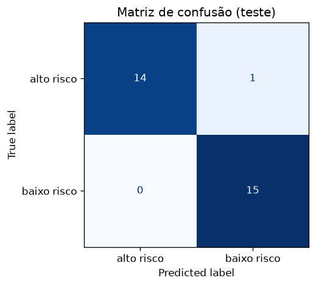
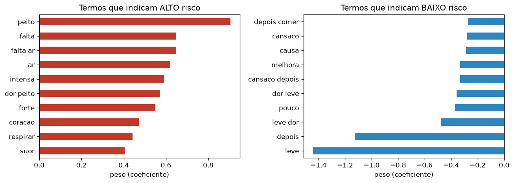

# FIAP - Faculdade de Informática e Administração Paulista

<p align="center">
<a href= "https://www.fiap.com.br/"></a>
</p>

<br>

# CardioIA · Fase 2 — Diagnóstico Automatizado: IA no Estetoscópio Digital

## Grupo 96

## 👨‍🎓 Integrantes: 
- <a href="https://github.com/matheus-meissner">Matheus Iembo Meissner</a> — RM567080

## 👩‍🏫 Professores:
### Tutor(a) 
- Leonardo Ruiz Orabona
### Coordenador(a)
- André Godoi Chiovato

## 🎥 Vídeo de demonstração

**▶️ [ADICIONAR AQUI O LINK DO YOUTUBE (não listado)]**

> ⚠️ **Aviso:** projeto **acadêmico**, com dados **simulados**. As sugestões geradas **não são diagnóstico médico** e não devem ser usadas para decisões clínicas reais.

## 📜 Descrição

O **CardioIA** parte de um problema real: as doenças cardiovasculares estão entre as principais causas de morte no mundo, e muitas poderiam ser evitadas com diagnóstico precoce. Nesta **Fase 2**, o desafio é simular a **automatização do diagnóstico com IA**, prática usada em centros de diagnóstico modernos, em que algoritmos funcionam como "estetoscópios digitais".

A solução é um módulo inteligente que analisa relatos clínicos em texto, reconhece sintomas e propõe diagnósticos assistidos, em duas partes:

- **Parte 1 — Extração de sintomas e sugestão de diagnóstico.** Dez frases em primeira pessoa simulam relatos de pacientes (o que sentem, quando começou, como afeta a rotina). Um **mapa de conhecimento** em CSV (78 regras, 10 doenças cardiovasculares) relaciona expressões de sintomas a doenças. Um script Python lê as frases, identifica os sintomas, **ranqueia** as doenças candidatas e sinaliza empates e hipóteses alternativas.
- **Parte 2 — Classificador de risco.** Um dataset de 120 frases rotuladas como *alto risco* ou *baixo risco* é transformado em vetores numéricos com **TF-IDF**, e modelos simples do scikit-learn (Regressão Logística e Árvore de Decisão) são treinados, testados e avaliados. A análise vai além da acurácia: examina erros, termos mais influentes, negação e possíveis vieses, em linha com o tema de **governança em dados** e IA responsável.

Resultados em resumo: a Parte 1 sugeriu o diagnóstico esperado em **10 de 10** frases; a Parte 2 atingiu **96,7%** de acurácia no teste e **95%** na validação cruzada. Como os dados são simulados e pequenos, esses números **não representam desempenho em relatos reais** (ver limitações).

## 📁 Estrutura de pastas

Dentre os arquivos e pastas presentes na raiz do projeto, definem-se:

- <b>.github</b>: Nesta pasta ficarão os arquivos de configuração específicos do GitHub que ajudam a gerenciar e automatizar processos no repositório.

- <b>assets</b>: aqui estão os arquivos relacionados a elementos não-estruturados deste repositório, como imagens (logo da FIAP).

- <b>config</b>: arquivos de configuração do projeto. Aqui está o `requirements.txt` com as dependências Python.

- <b>document</b>: documentos do projeto. A documentação desta fase está neste README. Na subpasta "other" ficam documentos complementares.

- <b>scripts</b>: scripts auxiliares (deploy, migrações, backups). Não há scripts auxiliares nesta fase.

- <b>src</b>: todo o código fonte do projeto:
  - `src/parte1_extracao_sintomas/`
    - `frases_sintomas.txt`: 10 frases de pacientes
    - `mapa_conhecimento.csv`: mapa sintomas → doenças (78 regras)
    - `extrator_diagnostico.py`: leitura, extração de sintomas e sugestão de diagnóstico
    - `resultado_diagnosticos.csv`: saída gerada pelo script
  - `src/parte2_classificador_risco/`
    - `dataset.csv`: 120 frases rotuladas (`frase,situacao`)
    - `classificador_risco.ipynb`: TF-IDF + classificação + avaliação (com saídas)
    - `classificador_risco.py`: mesmo código em formato de script
    - `matriz_confusao.png`, `termos_mais_influentes.png`: gráficos gerados

- <b>README.md</b>: arquivo que serve como guia e explicação geral sobre o projeto (o mesmo que você está lendo agora).

## 🔧 Como executar o código

**Pré-requisitos:** Python 3.10 ou superior (testado com 3.12). Bibliotecas: NumPy, pandas (< 3), scikit-learn, Matplotlib e Jupyter, listadas em `config/requirements.txt`.

```bash
# 1) baixar o código
git clone https://github.com/matheus-meissner/cardioia-fase2-diagnostico-ia.git
cd cardioia-fase2-diagnostico-ia

# 2) (opcional) ambiente virtual
python -m venv .venv
.venv\Scripts\activate          # Windows
# source .venv/bin/activate     # Linux / macOS

# 3) dependências
pip install -r config/requirements.txt
```

**Fase 2 — Parte 1 (extração de sintomas):**

```bash
python src/parte1_extracao_sintomas/extrator_diagnostico.py
```

**Fase 2 — Parte 2 (classificador de risco):**

```bash
python src/parte2_classificador_risco/classificador_risco.py
# ou, em notebook:
jupyter notebook src/parte2_classificador_risco/classificador_risco.ipynb
```

Os scripts usam caminhos relativos ao próprio arquivo, então podem ser executados de qualquer pasta.

> **Windows:** se um pacote falhar com *"Uma política de Controle de Aplicativo bloqueou este arquivo"* (Smart App Control), instale outra versão do pacote afetado. No desenvolvimento, `pandas<3` e `scikit-learn==1.7.2` funcionaram.

---

## 🩺 Parte 1 — Frases de sintomas e extração de informações

### Como funciona

1. **Relatos** (`frases_sintomas.txt`): 10 frases em primeira pessoa, cada uma descrevendo *o que o paciente sente*, *quando começou* e *como isso afeta a rotina*. Exemplo:
   > *"Sinto um aperto no peito toda vez que subo escada ou ando mais rápido; começou há três semanas e melhora ao descansar, mas já me fez deixar de caminhar com meus filhos."*
2. **Mapa de conhecimento** (`mapa_conhecimento.csv`): tabela com as colunas `Sintoma 1`, `Sintoma 2` e `Doença Associada`. São **78 regras** para **10 doenças**: Infarto Agudo do Miocárdio, Angina, Insuficiência Cardíaca, Arritmia Cardíaca, Hipertensão Arterial, Pericardite, Embolia Pulmonar, Trombose Venosa Profunda, Estenose Aórtica e Endocardite Infecciosa. Um mesmo sintoma pode aparecer em várias doenças (ex.: "dor no peito"), o que torna o ranqueamento necessário.
3. **Extrator** (`extrator_diagnostico.py`):
   - **Normaliza** o texto (minúsculas, sem acentos) para comparar expressões;
   - **Identifica** na frase as expressões do mapa, usando limites de palavra;
   - **Prioriza a expressão mais específica**: se "falta de ar intensa" foi encontrada, "falta de ar" no mesmo trecho não conta separadamente;
   - **Ranqueia** as doenças pelo número de sintomas distintos encontrados e **desempata** pelo número de regras em que os *dois* sintomas aparecem juntos;
   - **Sinaliza empates** como "requer avaliação médica" e lista as hipóteses alternativas;
   - **Valida** contra um gabarito e grava `resultado_diagnosticos.csv`.

### Resultado

Concordância com o gabarito: **10/10**, sem empates.

| # | Sintomas identificados | Diagnóstico sugerido |
|---|---|---|
| 1 | dor no peito, suor frio, irradia para o braço | Infarto Agudo do Miocárdio |
| 2 | aperto no peito, subo escada, ando mais rápido, melhora ao descansar | Angina |
| 3 | cansaço constante, tornozelos inchados, dormir com dois travesseiros | Insuficiência Cardíaca |
| 4 | coração disparado, batimentos irregulares, tontura | Arritmia Cardíaca |
| 5 | dor de cabeça na nuca, zumbido no ouvido, pressão alta | Hipertensão Arterial |
| 6 | resfriado, dor no peito, piora ao respirar fundo, ao deitar, me inclino para frente | Pericardite |
| 7 | falta de ar intensa, dor ao respirar, viagem longa | Embolia Pulmonar |
| 8 | panturrilha inchada, perna quente, dor na perna, depois de uma cirurgia | Trombose Venosa Profunda |
| 9 | desmaiei, carregar peso, cansaço ao subir, sopro no coração | Estenose Aórtica |
| 10 | febre alta, calafrios, suor noturno, perdi peso, tratamento dentário | Endocardite Infecciosa |

> **Observação:** as frases e o mapa foram escritos por mim. Por isso o 10/10 mostra que a lógica funciona, mas **não** mede o desempenho em relatos reais, que usam vocabulário muito mais variado (ver limitações).

---

## 📊 Parte 2 — Classificador básico de texto (alto × baixo risco)

### Dados

`dataset.csv` tem **120 frases** no formato `frase,situacao`, **balanceadas** (60 *alto risco* e 60 *baixo risco*). Para o modelo não decidir só por palavras-chave óbvias, o dataset inclui casos difíceis, como *"dor leve no peito só ao apertar o local depois de bater na quina da mesa"* (baixo risco) e *"desmaiei de repente e acordei confuso"* (alto risco).

### Método

1. **Divisão:** 75% treino (90 frases) e 25% teste (30 frases), **estratificada** pelo rótulo e com `random_state=42`.
2. **TF-IDF** (`TfidfVectorizer`): unigramas e bigramas, sem acentos e com TF sublinear. A matriz de treino tem 90 frases × 661 termos. A lista de stopwords mantém palavras como *não* e *sem*, que mudam o sentido clínico.
3. **Modelos:** Regressão Logística e Árvore de Decisão, cada um em um `Pipeline` (TF-IDF → classificador). O vetorizador só vê os dados de treino, o que evita vazamento de dados.
4. **Avaliação:** acurácia no teste, **validação cruzada estratificada de 5 partes** (mais estável com tão poucos dados), relatório de classificação, matriz de confusão e análise dos erros.

### Resultados

| Modelo | Acurácia (teste, 30 frases) | Acurácia média (CV 5-fold) | Desvio (CV) |
|---|---|---|---|
| **Regressão Logística** | **96,7%** | **95,0%** | 3,1 p.p. |
| Árvore de Decisão | 96,7% | 88,3% | 7,6 p.p. |

Relatório da Regressão Logística no conjunto de teste:

| Classe | Precisão | Recall | F1 | Suporte |
|---|---|---|---|---|
| alto risco | 1,000 | 0,933 | 0,966 | 15 |
| baixo risco | 0,938 | 1,000 | 0,968 | 15 |





**Leitura dos resultados**

- Os dois modelos empataram no teste, mas a **Regressão Logística é mais estável** na validação cruzada e é **interpretável**: os coeficientes mostram quais termos empurram a decisão. Por isso foi escolhida como modelo principal.
- Com apenas 30 frases de teste, **cada erro vale ~3,3 pontos percentuais**; a validação cruzada dá a estimativa mais confiável.
- O único erro do teste foi um **falso negativo**: *"perdi a consciência por alguns segundos enquanto caminhava"* (alto risco) foi classificada como baixo risco, com 47% de probabilidade de alto risco. Em triagem, esse é o erro mais grave.

### Observando distorções e vieses

O notebook testa o modelo com frases novas. O que apareceu:

| Teste | Observação |
|---|---|
| **Negação** | *"não tenho dor no peito"* foi classificada como **alto risco (70%)**. TF-IDF trata o texto como um conjunto de palavras e não entende negação. |
| **Gênero** | *"homem de 55 anos com dor no peito"* e *"mulher de 55 anos com dor no peito"* tiveram exatamente **72%**. Isso **não prova ausência de viés**: as palavras "homem" e "mulher" nunca aparecem no dataset, então o modelo as ignora. |
| **Apresentação atípica** | Frases como *"sinto náusea e um cansaço fora do normal há dias"* ficaram perto do limite (52%), mostrando incerteza em quadros menos típicos. |
| **Viés de vocabulário** | Termos como *intensa* e *forte* empurram para alto risco; *leve* e *pequeno*, para baixo risco. Um paciente que minimiza os sintomas pode ser subclassificado. |

---

## ⚖️ Limitações e governança de dados

- **Dados simulados e pequenos.** Os datasets foram escritos por mim. Frases de uma mesma classe compartilham vocabulário, então a acurácia **tende a ser otimista** e não representa o desempenho em relatos reais.
- **Sem representatividade.** Não há variação de gênero, idade ou apresentação atípica, como a de mulheres com infarto. Em um sistema real, isso pode gerar subdiagnóstico de grupos sub-representados.
- **Sem tratamento de negação ou contexto.** Tanto o extrator (correspondência de expressões) quanto o TF-IDF trabalham com palavras, não com significado.
- **Falso negativo é o erro mais caro.** Em um produto real, o limiar de decisão deveria priorizar o *recall* de alto risco, aceitando mais falsos positivos.
- **Dados reais exigem cuidados.** Seria necessário anonimização, consentimento, base legal (LGPD) e validação por profissionais de saúde.

### Próximos passos

Ampliar o dataset com dados reais anonimizados e com aval ético; tratar negação; usar embeddings ou modelos de linguagem em português; medir desempenho por subgrupos (gênero, idade) e validar com cardiologistas.

## 🛠️ Tecnologias

Python 3 · scikit-learn (TF-IDF, Regressão Logística, Árvore de Decisão) · pandas · NumPy · Matplotlib · Jupyter

## 🗃 Histórico de lançamentos

* 0.2.0 - 06/10/2026
    * Parte 2: dataset de 120 frases, TF-IDF, Regressão Logística e Árvore de Decisão, avaliação e análise de vieses
* 0.1.0 - 06/10/2026
    * Parte 1: frases de pacientes, mapa de conhecimento e extrator de sintomas com sugestão de diagnóstico

## 📋 Licença

<p xmlns:cc="http://creativecommons.org/ns#" xmlns:dct="http://purl.org/dc/terms/"><a property="dct:title" rel="cc:attributionURL" href="https://github.com/agodoi/template">MODELO GIT FIAP</a> por <a rel="cc:attributionURL dct:creator" property="cc:attributionName" href="https://fiap.com.br">Fiap</a> está licenciado sobre <a href="http://creativecommons.org/licenses/by/4.0/?ref=chooser-v1" target="_blank" rel="license noopener noreferrer" style="display:inline-block;">Attribution 4.0 International</a>.</p>
